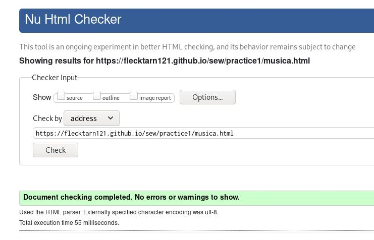
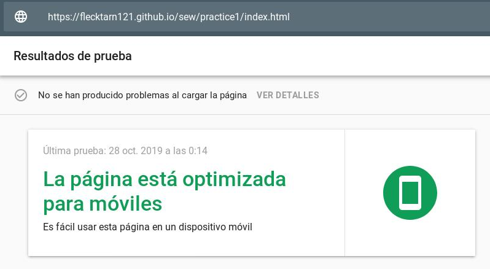

# Archivos del proyecto

El proyecto lo componen 7 archivos html:

- index.html: página introductoria donde se explica qué es la serie
- argumentoConcepción.html: explicación básica del argumento de la serie, así como su concepción.
- escenarios.html: breve reseña de los escenarios en los que se desarrolla la trama.
- música.html: mención a la banda sonora de la serie.
- personajes.html: índice de los principales personajes de la obra.
- temas.html: repaso de las diversas temáticas tratas en Los Soprano.
- temporadasPremios.html: recopilatorio de los premios con los que se galardonó a la serie, amén de las temporadas que la componen.

Todos ellos se encuentran a un nivel jerárquico igual dentro del directorio.
Se incluye además un documento _style.css_ , con la hoja de estilos empleada, y una carpeta _multimedia_ con las imágenes, vídeos y audios empleados.

# Estructura semántica

Todos los documentos siguen el mismo patrón:

- Una cabecera con los metadatos del sitio web.
- Un cuerpo que a su vez cuenta con:
    - Un encabezado con título y menú de navegación.
    - El contenido principal, dividido en secciones.
    - Un pie con enlaces de interés, información de contacto del autor, y los iconos de validación.

Todos los archivos han sido sometidos al validador del W3C, y ninguno presenta errores o advertencias.

# Resultados de las herramientas de comprobación

A continuación se exponen y explican los resultados de las herramientas de verificación, con las capturas de pantalla oportunas.

## Validador del W3C

Los html se han sometido a dicha herramienta, dando todos 0 errores y advertencias, como puede apreciarse en las figuras 1, 2, 3, 4, 5, 6 y 7.

{height=350px}

{height=350px}

{height=350px}

{height=350px}

{height=350px}

{height=350px}

{height=350px}

## TAW

Este validador ya arroja entre 4 y 10 advertencias dependiendo del documento que se analice, como se puede apreciar en la figuras 8 a 14.
La mayoría son relacionadas con el contenido, ergo, difíciles de determinar categóricamente por una máquina.
El informe recomienda su revisión manual, pues no puede por sí misma la herramienta determinar si se cumple o no el criterio.
Estas son:

- Contenido no textual: se refiere a los vídeos y música, puesto que las imágenes poseen texto alternativo.
- Información y relaciones: si la información se ve reflejada en la estructura del etiquetado (como así es, por el uso de secciones y otras etiquetas de estructura).
- Páginas titulas: todas las páginas poseen el título del sitio más uno propio que describe el contenido del documento en particular
- Encabezado y etiquetas: los encabezados son por sí mismos descriptivos del contenido de la etiqueta que encabezan.

{height=250px}

{height=250px}

{height=250px}

{height=250px}

{height=250px}

{height=250px}

{height=250px}

## Google Mobile-friendly

Al tratarse de un sitio web con el marcado adecuado y con un CSS muy básico, la página no da ningún problema a la hora de funcionar en un dispositivo móvil.
Puede comprobarse en las figuras 17 a 21.

{height=300px}

{height=300px}

{height=300px}

{height=300px}

{height=300px}

{height=300px}

{height=300px}

