# Estructura general

El sitio web cumple con estructura que se puede apreciar en la figura 1, esto es, un elemento `nav` superior con el título y menú de navegación, un cuerpo estructurado en dos columnas (la izquierda el contenido y la derecha el `aside`) y un footer al final.

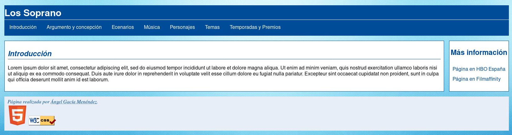

Se emplea una única hoja de estilos, denominada `style.css` para todos los documentos.

Asimismo, los html están exactamente igual que en la anterior práctica, son la salvedad de la lista _más información_, la cual ha sido trasladada a un `aside` en `index.html`, y eliminada en los demás.

# Resultados de las herramientas de comprobación

A continuación se exponen y explican los resultados de las herramientas de verificación, con las capturas de pantalla oportunas.

## Validador del W3C

La hoja de estilos del sitio web fue sometida a la herramienta de validación del W3C, dónde fue necesario corregir algunos aspectos (ausencia de la definición del color de fondo generalmente) para eliminar del todo las advertencias.

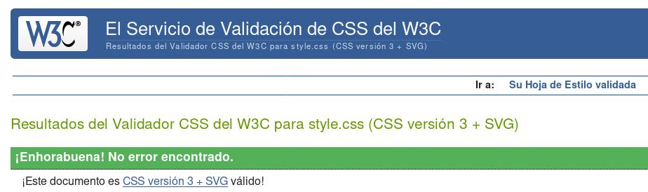{height=350px}

## TAW

Este validador ya arroja entre 4 y 10 advertencias dependiendo del documento que se analice, como se puede apreciar en la figuras 3 a 9.
La mayoría son relacionadas con el contenido, ergo, difíciles de determinar categóricamente por una máquina.
El informe recomienda su revisión manual, pues no puede por sí misma la herramienta determinar si se cumple o no el criterio.
Estas son:

- Contenido no textual: se refiere a los vídeos y música, puesto que las imágenes poseen texto alternativo.
- Información y relaciones: si la información se ve reflejada en la estructura del etiquetado (como así es, por el uso de secciones y otras etiquetas de estructura).
- Páginas titulas: todas las páginas poseen el título del sitio más uno propio que describe el contenido del documento en particular
- Encabezado y etiquetas: los encabezados son por sí mismos descriptivos del contenido de la etiqueta que encabezan.

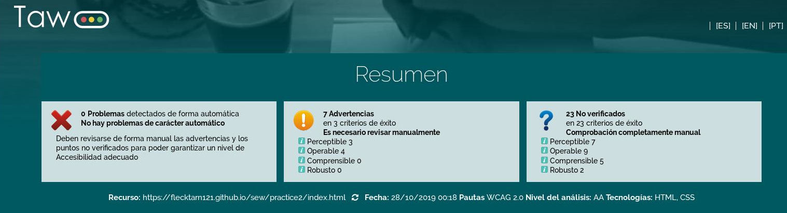{height=250px}

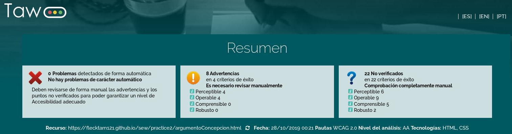{height=250px}

{height=250px}

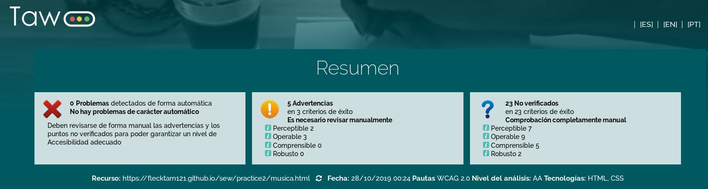{height=250px}

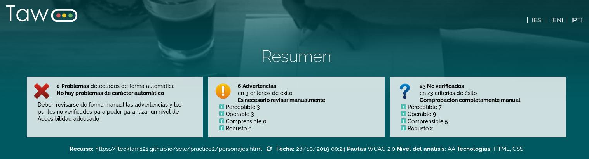{height=250px}

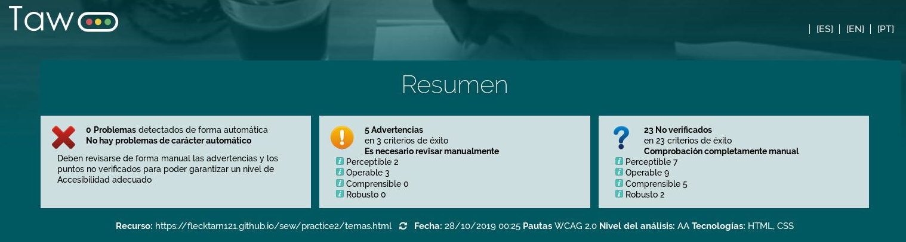{height=250px}

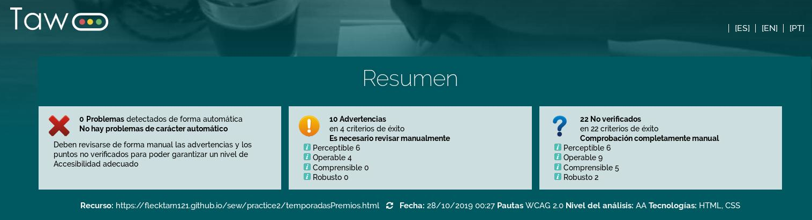{height=250px}

## Google Mobile-friendly

El CSS, si bien más complejo que en la práctica anterior, sigue dando positivo en adaptabilidad a móvil, como se puede ver en las figuras 10 a 16.
Se ha tenido especial cuidad con la responsividad de imágenes y vídeos.

{height=300px}

{height=300px}

{height=300px}

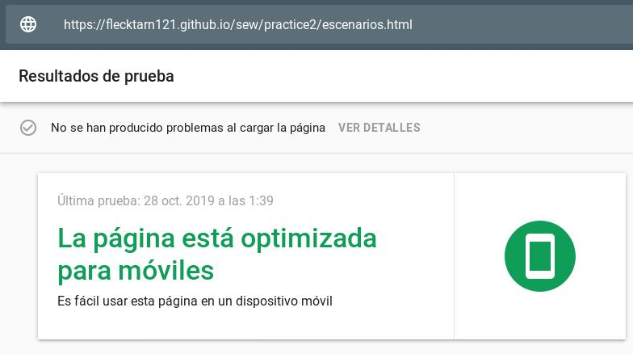{height=300px}

{height=300px}

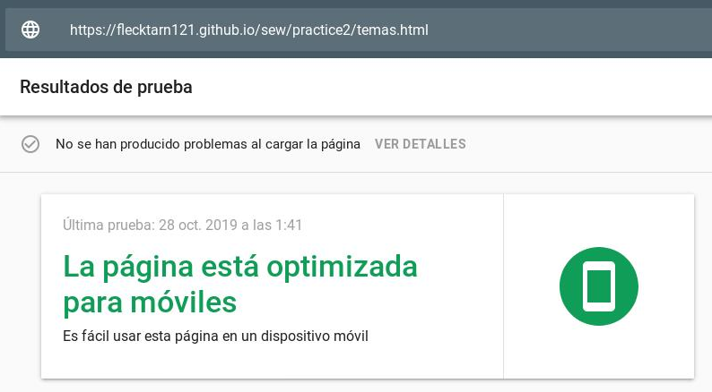{height=300px}

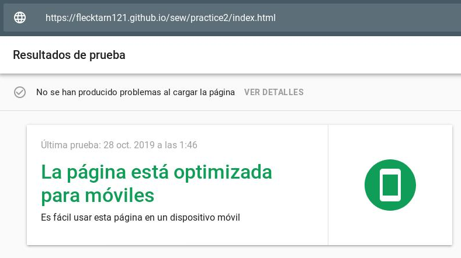{height=300px}

